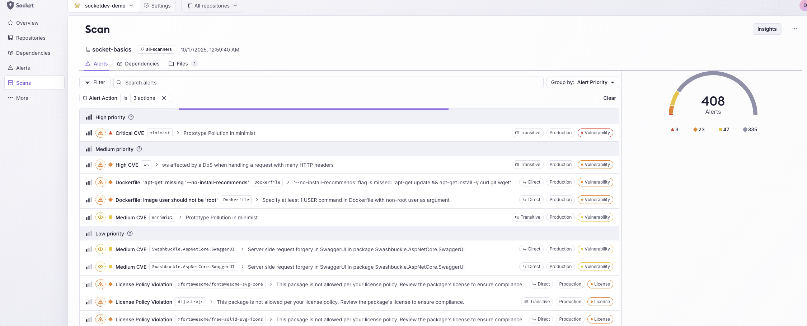
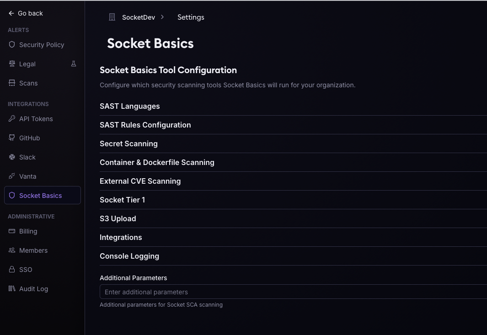
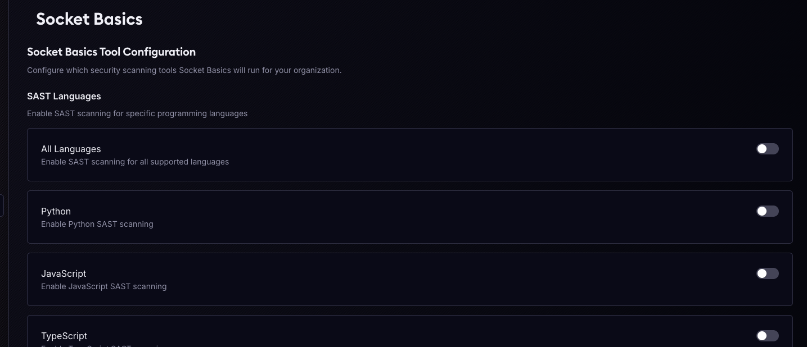

# Socket Basics

**Comprehensive security scanning with SAST, secrets detection, container scanning, and more — all in one unified tool.**

Socket Basics orchestrates multiple security scanners, normalizes their outputs into Socket's standardized format, and delivers consolidated results through your preferred notification channels.



## 🚀 Quick Start - GitHub Actions

The easiest way to use Socket Basics is through GitHub Actions. Add it to your workflow in minutes:

```yaml
# .github/workflows/socket.yml

name: ⚡️ Security Scan

on:
  pull_request:
    types: [opened, synchronize, reopened]

permissions:
  contents: read

jobs:
  security-scan:
    permissions:
      issues: write
      contents: read
      pull-requests: write
    runs-on: ubuntu-24.04
    timeout-minutes: 15
    steps:
      - uses: actions/checkout@de0fac2e4500dabe0009e67214ff5f5447ce83dd # v6.0.2
      - name: ⚡️ Run Socket Basics
        uses: SocketDev/socket-basics@1.0.28
        env:
          GITHUB_PR_NUMBER: ${{ github.event.pull_request.number || github.event.issue.number }}
        with:
          github_token: ${{ secrets.GITHUB_TOKEN }}
          socket_security_api_key: ${{ secrets.SOCKET_SECURITY_API_KEY }}
```

**That's it!** With just your `SOCKET_SECURITY_API_KEY`, all scanning configurations are managed through the [Socket Dashboard](https://socket.dev/dashboard) — no workflow changes needed.

### What You Get

- ✅ **Zero Configuration Required** — Configure scanning policies in the Socket Dashboard
- ✅ **All Scanners Included** — SAST, secrets, containers, and dependency analysis
- ✅ **PR Comments** — Automated security findings on pull requests
- ✅ **Centralized Management** — Update policies across all repos from one place

📖 **[Complete GitHub Actions Guide →](docs/github-action.md)**

### Other Installation Methods

Socket Basics can also run locally or in other CI/CD environments:

- **[Pre-Commit Hook](docs/pre-commit-hook.md)** — Catch issues before they're committed
- **[Local Docker Installation](docs/local-install-docker.md)** — Run in Docker with no tool installation required
- **[Local Installation](docs/local-installation.md)** — Install security tools natively on your machine

## ✨ Features

**Built-in Security Scanners:**
- 🔍 **SAST** — Static analysis for 15+ languages (Python, JavaScript, Go, Java, Ruby, C#, and more)
- 🔐 **Secret Scanning** — Detect leaked credentials and API keys with TruffleHog
- 🐳 **Container Scanning** — Vulnerability scanning for Docker images and Dockerfiles with Trivy
- 📦 **Dependency Analysis** — Socket Tier 1 reachability analysis for supply chain security

**Enterprise Features** (requires [Socket Enterprise](https://socket.dev/enterprise)):
- 🎛️ **Dashboard Configuration** — Centrally manage scanning policies across your organization
- 📢 **Notification Integrations** — Send results to Slack, Jira, MS Teams, MS Sentinel, Sumo Logic, and webhooks
- 🔄 **Unified Reporting** — Consolidated security view across all your projects

**Flexible Configuration:**
- Configure via CLI flags, environment variables, JSON files, or the Socket Dashboard
- Auto-enablement for container scanning when images or Dockerfiles are specified
- Support for both standard and GitHub Actions `INPUT_*` environment variables

## 🎨 Enhanced PR Comments

Socket Basics delivers **beautifully formatted, actionable PR comments** with smart defaults — all enabled by default, zero configuration needed.

- 🔗 **Clickable File Links** — Jump directly to the vulnerable code in GitHub
- 📋 **Collapsible Sections** — Critical findings auto-expand, others collapse
- 🎨 **Syntax Highlighting** — Language-aware code blocks
- 🏷️ **Auto-Labels** — PRs tagged with severity-based labels (e.g., `security: critical`)
- 🔴 **CVE Links & CVSS Scores** — One-click access to NVD with risk context
- 🚀 **Full Scan Link** — Report link prominently displayed at the top

Every feature is customizable via GitHub Actions inputs, CLI flags, or environment variables.

📖 **[PR Comment Guide →](docs/github-pr-comment-guide.md)** — Full customization options, examples, and configuration reference

## 📖 Documentation

### Getting Started
- [GitHub Actions Integration](docs/github-action.md) — Complete guide with workflow examples
- [PR Comment Guide](docs/github-pr-comment-guide.md) — Detailed guide to PR comment customization
- [Pre-Commit Hook Setup](docs/pre-commit-hook.md) — Two installation methods (Docker vs native)
- [Local Docker Installation](docs/local-install-docker.md) — Run with Docker, no tools to install
- [Local Installation](docs/local-installation.md) — Install Socket CLI, Trivy, and other tools natively

### Configuration
All configuration can be managed through:
1. **Socket Dashboard** (Enterprise) — Centralized policy management
2. **CLI Arguments** — Direct command-line flags
3. **Environment Variables** — Standard or `INPUT_*` prefixed for GitHub Actions
4. **JSON Configuration File** — Structured configuration (see `socket_config_example.json`)

See [Configuration Documentation](docs/configuration.md) for details on all available options.

#### Integration Environment Variables

Socket Basics supports special environment variables for integration with other tools:

- **`SKIP_SOCKET_REACH=1`** — Skip Socket Tier 1 reachability analysis. This allows external tools (like the Node.js Socket CLI) to skip redundant reachability scans when the analysis will be performed separately or is not needed for a particular workflow.

- **`SKIP_SOCKET_SUBMISSION=1`** — Skip submission to Socket API while still generating `.socket.facts.json`. This allows external tools (like the Node.js Socket CLI) to collect the facts file and submit it along with other data in a unified API call. When this is set, Socket Basics will complete all scanning and generate the facts file, but will not make the API submission call.

## 🎯 What Socket Basics Does

1. **Scans** your codebase using multiple security tools in parallel
2. **Normalizes** all findings into a unified Socket facts JSON format
3. **Filters** results based on severity thresholds and configured rules
4. **Reports** consolidated findings through console, files, or notification channels

## 🏢 Enterprise Dashboard Configuration

Socket Enterprise customers can configure Socket Basics directly from the [Socket Dashboard](https://socket.dev/dashboard):



Configure scanning policies, notification channels, and rule sets for your entire organization in one place. Your settings are automatically synchronized when you provide `SOCKET_SECURITY_API_KEY` and `SOCKET_ORG`.



## 💻 Other Usage Methods

For GitHub Actions, see the [Quick Start](#-quick-start---github-actions) above or the **[Complete GitHub Actions Guide](docs/github-action.md)** for advanced workflows.

### Docker

```bash
# Build with version tag
docker build -t socketdev/socket-basics:1.0.28 .

# Run scan
docker run --rm -v "$PWD:/workspace" socketdev/socket-basics:1.0.28 \
  --workspace /workspace \
  --python-sast-enabled \
  --secret-scanning-enabled \
  --console-tabular-enabled
```

📖 **[View Docker Installation Guide](docs/local-install-docker.md)**

### CLI

```bash
socket-basics --python --secrets --containers --verbose
```

📖 **[View Local Installation Guide](docs/local-installation.md)**

## 🔧 Requirements

**For GitHub Actions & Docker:** No installation needed — all tools are bundled in the container.

**For Local Installation:**
- Python 3.8+
- [Socket CLI](https://docs.socket.dev/docs/cli) (for dependency analysis)
- [Trivy](https://github.com/aquasecurity/trivy) (for container scanning)
- [OpenGrep/Semgrep](https://semgrep.dev/) (for SAST)
- [TruffleHog](https://github.com/trufflesecurity/trufflehog) (for secret scanning)

See [Local Installation Guide](docs/local-installation.md) for detailed setup instructions.

## 📊 Output Format

Socket Basics normalizes all scanner findings into a standardized Socket facts JSON structure:

```json
{
  "components": [
    {
      "type": "file",
      "name": "path/to/file",
      "alerts": [
        {
          "type": "sast|secret|container",
          "severity": "low|medium|high|critical",
          "message": "description",
          "location": {"path": "file/path", "line": 42}
        }
      ]
    }
  ]
}
```

Results can be:
- **Printed to console** in tabular or JSON format
- **Written to file** (`.socket.facts.json`)
- **Sent to notification channels** (Slack, Jira, webhooks, etc.)

## 🔌 Connector Architecture

Socket Basics uses a plugin-style connector system. Each connector:
- Lives under `socket_basics/core/connector/`
- Implements `scan()` to execute the underlying tool
- Implements `_process_results()` to normalize output

Add new connectors by:
1. Creating a directory under `socket_basics/core/connector/<tool>/`
2. Implementing the connector class
3. Adding configuration to `socket_basics/connectors.yaml`

See the [Developer Guide](docs/development.md) for details.

## 🧪 Testing

Integration tests for connectors live in `app_tests/`. This is the authoritative location for connector-level testing with sample repositories.

```bash
# Run tests
python -m pytest app_tests/ -v

# Run specific connector tests
python -m pytest app_tests/test_trivy.py -v
```

## 🐛 Troubleshooting

**Connector fails to load:**
- Verify `module_path` and `class` in `socket_basics/connectors.yaml`

**Socket API errors:**
- Ensure `SOCKET_SECURITY_API_KEY` and `SOCKET_ORG` are set correctly
- Verify your Socket Enterprise subscription is active

**Notifier errors:**
- Check that notification credentials (Slack webhook, Jira token, etc.) are properly configured
- Remember: Notifiers require Socket Enterprise

**Image scanning failures:**
- Confirm Docker access in your runtime environment
- For GitHub Actions, ensure images are publicly accessible or credentials are provided

**Enable verbose logging:**
```bash
socket-basics --verbose ...
# or
INPUT_VERBOSE=true socket-basics ...
```

## 🤝 Contributing

We welcome contributions! To add new features:

1. **New Connectors:** Implement under `socket_basics/core/connector/`
2. **New Notifiers:** Implement under `socket_basics/core/notification/`
3. **Configuration:** Add entries to `socket_basics/connectors.yaml` or `socket_basics/notifications.yaml`
4. **Tests:** See [Testing](#-testing) section below

## 🧪 Testing

Socket Basics uses a two-tier testing strategy to ensure code quality and scanner accuracy.

### Test Structure

```
socket-basics/
├── tests/              # Unit & integration tests (pytest)
│   └── test_*.py      # Fast, isolated tests of functions/modules
└── app_tests/         # End-to-end test fixtures
    ├── juice-shop/    # Node.js vulnerable app
    ├── pygoat/        # Python vulnerable app
    ├── NodeGoat/      # Node.js vulnerable app
    ├── DVWA/          # PHP vulnerable app
    └── ...            # Other deliberately vulnerable apps
```

### Running Unit Tests

**Quick test run:**
```bash
# Setup (first time only)
python3 -m venv venv
source venv/bin/activate
pip install -e ".[dev]"

# Run all unit tests
pytest

# Run specific test file
pytest tests/test_github_helpers.py

# Run with verbose output
pytest -v

# Run with coverage report
pytest --cov=socket_basics tests/
```

**Characteristics:**
- ⚡ **Fast** — Milliseconds to seconds
- 🎯 **Isolated** — No external dependencies
- 🔄 **Frequent** — Run on every commit
- ✅ **Validates** — Code logic and functions

### End-to-End Testing with Real Apps

The `app_tests/` directory contains deliberately vulnerable applications (git submodules) for validating scanner accuracy.

**Purpose:**
- Verify scanners detect **known vulnerabilities**
- Test against **real-world code patterns**
- Ensure **multi-language coverage**
- Validate **entire scan pipeline**

**Run E2E tests:**
```bash
# Scan a vulnerable Node.js app
socket-basics --workspace app_tests/juice-shop \
  --javascript-sast-enabled \
  --secret-scanning-enabled

# Scan a vulnerable Python app
socket-basics --workspace app_tests/pygoat \
  --python-sast-enabled \
  --secret-scanning-enabled

# Compare results against known vulnerabilities
# (Manual verification of findings)
```

**Characteristics:**
- 🐢 **Slow** — Minutes per app
- 📦 **Large** — Git submodules with full apps
- 🎯 **Ground truth** — Known vulnerabilities to detect
- ✅ **Validates** — Scanner accuracy and coverage

### Adding Tests

**Adding Unit Tests:**
```python
# tests/test_new_feature.py
import pytest
from socket_basics.module import new_function

def test_new_feature():
    result = new_function(input_data)
    assert result == expected_output
```

**Adding E2E Test Fixtures:**
```bash
# Add a new vulnerable app as a git submodule
cd app_tests/
git submodule add https://github.com/org/vulnerable-app
git submodule update --init
```

### Test Best Practices

**For contributors:**
1. ✅ Add unit tests for new functions/modules
2. ✅ Run `pytest` before committing
3. ✅ Validate changes against `app_tests/` fixtures
4. ✅ Keep unit tests fast (mock external dependencies)

**For security researchers:**
1. 🔍 Use `app_tests/` to validate scanner accuracy
2. 📊 Compare findings against CVE databases
3. 🎯 Add new vulnerable apps as needed
4. 📝 Document expected findings for regression testing

### CI/CD Testing

```yaml
# Example GitHub Actions workflow
- name: Run Unit Tests
  run: |
    pip install -e ".[dev]"
    pytest tests/ --cov=socket_basics

- name: Run E2E Tests (Selected)
  run: |
    # Run against specific vulnerable apps
    socket-basics --workspace app_tests/pygoat --python
```

---

## 🔗 Resources

- [Socket Security](https://socket.dev/) — Main website
- [Socket Dashboard](https://socket.dev/dashboard) — Configure Socket Basics (Enterprise)
- [Socket Documentation](https://docs.socket.dev/) — Complete documentation
- [Socket CLI](https://docs.socket.dev/docs/cli) — Dependency analysis tool
- [Socket Pricing](https://socket.dev/pricing) — Socket Pricing Details

---

**Need help?** Visit our [documentation](docs/) or contact [Socket Support](https://socket.dev/support).

