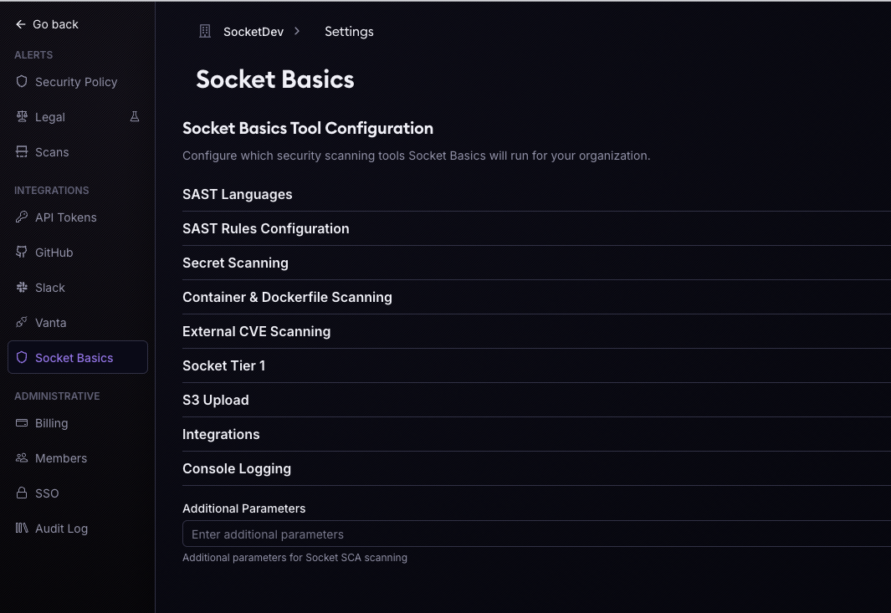
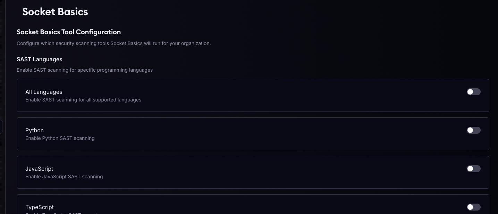
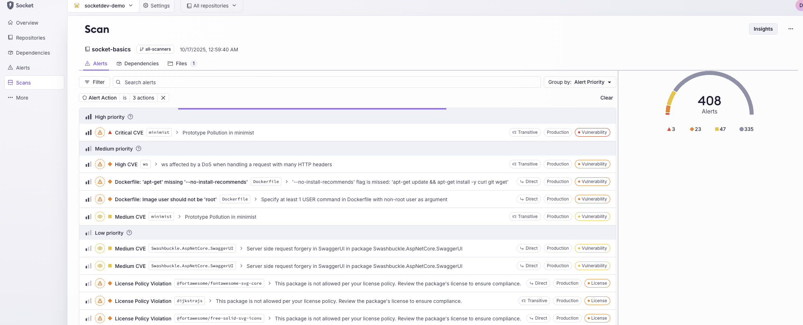

# GitHub Actions Integration

Complete guide to integrating Socket Basics into your GitHub Actions workflows for automated security scanning.

## Table of Contents

- [Quick Start](#quick-start)
- [Performance and Caching](#performance-and-caching)
- [Basic Configuration](#basic-configuration)
- [Enterprise Features](#enterprise-features)
- [Advanced Workflows](#advanced-workflows)
  - [Dockerfile Auto-Discovery](#dockerfile-auto-discovery)
- [Configuration Reference](#configuration-reference)
- [Troubleshooting](#troubleshooting)

## Quick Start

Add Socket Basics to your workflow in 3 steps:

1. **Create workflow file** at `.github/workflows/security-scan.yml`
2. **Add required secrets** to your repository
3. **Configure scanning options**

### Minimal Example

```yaml
name: Security Scan
on:
  pull_request:
    types: [opened, synchronize, reopened]

permissions:
  contents: read

jobs:
  security-scan:
    permissions:
      issues: write
      contents: read
      pull-requests: write
    runs-on: ubuntu-24.04
    timeout-minutes: 15
    steps:
      - uses: actions/checkout@de0fac2e4500dabe0009e67214ff5f5447ce83dd # v6.0.2
      - name: Run Socket Basics
        uses: SocketDev/socket-basics@v2.0.2
        env:
          GITHUB_PR_NUMBER: ${{ github.event.pull_request.number || github.event.issue.number }}
        with:
          github_token: ${{ secrets.GITHUB_TOKEN }}
          socket_security_api_key: ${{ secrets.SOCKET_SECURITY_API_KEY }}
```

With just your `SOCKET_SECURITY_API_KEY`, all scanning configurations are managed through the [Socket Dashboard](https://socket.dev/dashboard) — no workflow changes needed.

## Performance and Caching

### How the action is currently built

When you reference `uses: SocketDev/socket-basics@v2.0.2`, GitHub Actions pulls the
pre-built image referenced by [`action.yml`](../action.yml). The historical multi-stage
Docker build still matters for maintainers because it determines what lands in the
published image:

| Improvement | Benefit |
|-------------|---------|
| Multi-stage stages (`trivy`, `trufflehog`, etc.) | GitHub's runner cache can reuse unchanged tool layers across runs |
| `python:3.12-slim` base | ~850 MB smaller final image → faster layer pulls on cold runners |
| `--mount=type=cache` for apt / uv / npm | Faster repeated builds locally and on self-hosted runners with a persistent cache |

**On standard GitHub-hosted runners** (ephemeral, no persistent Docker cache between
jobs), users mainly benefit from pulling a ready-made image instead of rebuilding
Socket Basics from source in every workflow run.

### Pre-built image

Starting with v2, the action pulls a pre-built image from GHCR rather than
building from source on every run. Pinning to a specific version tag (e.g. `@v2.0.2`)
means the action starts in seconds — the image is built, integration-tested, and
published before the release tag is ever created.

### If you're running socket-basics outside of the GitHub Action

If you run socket-basics in other CI systems (Jenkins, GitLab, CircleCI, etc.) or
as a standalone `docker run`, pull the pre-built image directly:

```bash
docker pull ghcr.io/socketdev/socket-basics:2.0.2
```

See [Local Docker Installation](local-install-docker.md) for usage examples.

### Why we're opinionated about pinning

Socket Basics is a security tool. Its own supply-chain integrity matters — if
the action itself is compromised or ships a bad release, every repo running it
is immediately affected. We've seen this happen across the ecosystem:

- **Floating tags** (`@v2`, `:latest`) auto-update on every new release.
  A single bad push silently reaches all users with no review gate. This is
  structurally identical to `docker pull :latest` — the anti-pattern we
  explicitly warn against in our Docker docs.
- **Version tags** (`@v2.0.2`) are better, but tags are mutable by default.
  A tag can be deleted and recreated pointing at a different commit. There are
  documented cases of this happening — maliciously and accidentally.
- **Commit SHAs** are the only truly immutable reference. A SHA cannot be
  reassigned. Combined with Dependabot, you get automated upgrades with a
  human review gate at zero ongoing maintenance cost.

We don't publish a floating major tag (`v2`). We do publish immutable version
tags (`v2.0.2`) protected by tag protection rules in GitHub — but SHA pinning
is still the recommendation for defence in depth.

### Pinning strategies

Two supported approaches, both managed by Dependabot:

---

**Strategy 1 — Commit SHA pin + Dependabot** *(recommended)*

The only truly immutable reference. Dependabot keeps it current automatically.

```yaml
- name: Run Socket Basics
  # Dependabot keeps this SHA up to date — see .github/dependabot.yml setup below.
  uses: SocketDev/socket-basics@<sha>  # v2.0.2
  with:
    socket_security_api_key: ${{ secrets.SOCKET_SECURITY_API_KEY }}
```

Get the SHA for any release:
```bash
git ls-remote https://github.com/SocketDev/socket-basics refs/tags/v2.0.2
```

---

**Strategy 2 — Version tag pin + Dependabot**

Acceptable if you trust that tags are immutable (they are — socket-basics
enforces tag protection rules). SHA pinning is still preferable for defence
in depth.

```yaml
- uses: SocketDev/socket-basics@v2.0.2
  with:
    socket_security_api_key: ${{ secrets.SOCKET_SECURITY_API_KEY }}
```

---

**Dependabot setup (works for both strategies)**

Add or extend `.github/dependabot.yml` in your repo:

```yaml
version: 2
updates:
  - package-ecosystem: "github-actions"
    directory: "/"
    schedule:
      interval: "weekly"
```

Dependabot opens a PR for each new release, updating the SHA or version tag
and keeping the `# v2.0.2` comment in sync. You review, approve, and merge
on your own schedule — automated upgrades with a human gate.

---

**Comparison**

| Strategy | Immutable? | Auto-updates | Review gate |
|---|---|---|---|
| `@v2` floating tag | ❌ (not published) | — | — |
| `@v2.0.2` + Dependabot | ✅ (tag protection enforced) | Yes (weekly PR) | Yes |
| `@<sha>` + Dependabot | ✅ always | Yes (weekly PR) | Yes |

## Basic Configuration

### Required Permissions

Socket Basics requires the following permissions to post PR comments and create issues:

```yaml
permissions:
  issues: write        # Create and update issues for findings
  contents: read       # Read repository contents
  pull-requests: write # Post comments on pull requests
```

Include these in your workflow's `jobs.<job_id>.permissions` section.

### Required Inputs

**`github_token`** (required)
- GitHub token for posting PR comments and API access
- Use `${{ secrets.GITHUB_TOKEN }}` (automatically provided)

### Common Scanning Options

**SAST (Static Analysis):**
```yaml
- uses: SocketDev/socket-basics@v2.0.2
  with:
    github_token: ${{ secrets.GITHUB_TOKEN }}
    # Enable SAST for specific languages
    python_sast_enabled: 'true'
    javascript_sast_enabled: 'true'
    go_sast_enabled: 'true'
    java_sast_enabled: 'true'
    # Or enable all languages
    all_languages_enabled: 'true'
```

**Secret Scanning:**
```yaml
- uses: SocketDev/socket-basics@v2.0.2
  with:
    github_token: ${{ secrets.GITHUB_TOKEN }}
    secret_scanning_enabled: 'true'
    # Optional: exclude directories
    trufflehog_exclude_dir: 'node_modules,vendor,dist'
    # Optional: show unverified secrets
    trufflehog_show_unverified: 'true'
```

**Container Scanning:**
```yaml
- uses: SocketDev/socket-basics@v2.0.2
  with:
    github_token: ${{ secrets.GITHUB_TOKEN }}
    # The supported pre-built GitHub Action path currently ships without
    # Trivy while we evaluate the safest way to bundle it with Basics again.
    # Use a native install if you need container scanning today.
    # See docs/local-installation.md#trivy-container-scanning.
```

> [!NOTE]
> The supported pre-built GitHub Action and Docker image paths currently ship
> _without_ Trivy while we evaluate the safest way to bundle it with Basics
> again.
> If you need container or Dockerfile scanning today, use the
> [native installation path](local-installation.md). See
> [Trivy (Container Scanning)](local-installation.md#trivy-container-scanning)
> for the current version guidance and install options, and review the upstream
> install path and artifacts carefully before adopting that path in production
> CI.

**Socket Tier 1 Reachability:**
```yaml
- uses: SocketDev/socket-basics@v2.0.2
  with:
    github_token: ${{ secrets.GITHUB_TOKEN }}
    socket_tier_1_enabled: 'true'
```

### Output Configuration

```yaml
- uses: SocketDev/socket-basics@v2.0.2
  with:
    github_token: ${{ secrets.GITHUB_TOKEN }}
    python_sast_enabled: 'true'
    # Enable tabular console output
    console_tabular_enabled: 'true'
    # Or enable JSON output
    console_json_enabled: 'true'
    # Enable verbose logging for debugging
    verbose: 'true'
```

## PR Comment Customization

Socket Basics automatically posts enhanced PR comments with **smart defaults that work out of the box** — clickable file links, collapsible sections, syntax highlighting, CVE links, CVSS scores, and auto-labels are all enabled by default.

📖 **[PR Comment Guide →](github-pr-comment-guide.md)** — Complete customization options, configuration examples, and reference table

## Enterprise Features

Socket Basics Enterprise features require a [Socket Enterprise](https://socket.dev/enterprise) subscription.

### Dashboard Configuration

Configure Socket Basics centrally from the [Socket Dashboard](https://socket.dev/dashboard):



**Setup:**
1. Log in to [Socket Dashboard](https://socket.dev/dashboard)
2. Navigate to Settings → Socket Basics
3. Configure scanning policies, notification channels, and rule sets
4. Save your configuration

**Enable in workflow:**
```yaml
- uses: SocketDev/socket-basics@v2.0.2
  env:
    GITHUB_PR_NUMBER: ${{ github.event.pull_request.number || github.event.issue.number }}
  with:
    github_token: ${{ secrets.GITHUB_TOKEN }}
    # Dashboard configuration (Enterprise required)
    socket_org: 'your-org-slug'
    socket_security_api_key: ${{ secrets.SOCKET_SECURITY_API_KEY }}
```

> [!NOTE]
> You can also pass credentials using environment variables instead of the `with:` section:
> ```yaml
> - uses: SocketDev/socket-basics@v2.0.2
>   env:
>     SOCKET_SECURITY_API_KEY: ${{ secrets.SOCKET_SECURITY_API_KEY }}
>   with:
>     github_token: ${{ secrets.GITHUB_TOKEN }}
> ```
> Both approaches work identically. Use whichever fits your workflow style.

Your workflow will automatically use the settings configured in the dashboard.



### Notification Integrations

All notification integrations require Socket Enterprise.

**Slack Notifications:**
```yaml
- uses: SocketDev/socket-basics@v2.0.2
  with:
    github_token: ${{ secrets.GITHUB_TOKEN }}
    socket_org: ${{ secrets.SOCKET_ORG }}
    socket_security_api_key: ${{ secrets.SOCKET_SECURITY_API_KEY }}
    python_sast_enabled: 'true'
    # Slack webhook (Enterprise required)
    slack_webhook_url: ${{ secrets.SLACK_WEBHOOK_URL }}
```

**Jira Issue Creation:**
```yaml
- uses: SocketDev/socket-basics@v2.0.2
  with:
    github_token: ${{ secrets.GITHUB_TOKEN }}
    socket_org: ${{ secrets.SOCKET_ORG }}
    socket_security_api_key: ${{ secrets.SOCKET_SECURITY_API_KEY }}
    python_sast_enabled: 'true'
    # Jira integration (Enterprise required)
    jira_url: 'https://your-org.atlassian.net'
    jira_email: ${{ secrets.JIRA_EMAIL }}
    jira_api_token: ${{ secrets.JIRA_API_TOKEN }}
    jira_project: 'SEC'
```

**Microsoft Teams:**
```yaml
- uses: SocketDev/socket-basics@v2.0.2
  with:
    github_token: ${{ secrets.GITHUB_TOKEN }}
    socket_org: ${{ secrets.SOCKET_ORG }}
    socket_security_api_key: ${{ secrets.SOCKET_SECURITY_API_KEY }}
    python_sast_enabled: 'true'
    # MS Teams webhook (Enterprise required)
    msteams_webhook_url: ${{ secrets.MSTEAMS_WEBHOOK_URL }}
```

**Generic Webhook:**
```yaml
- uses: SocketDev/socket-basics@v2.0.2
  with:
    github_token: ${{ secrets.GITHUB_TOKEN }}
    socket_org: ${{ secrets.SOCKET_ORG }}
    socket_security_api_key: ${{ secrets.SOCKET_SECURITY_API_KEY }}
    python_sast_enabled: 'true'
    # Generic webhook (Enterprise required)
    webhook_url: ${{ secrets.WEBHOOK_URL }}
```

**SIEM Integration:**
```yaml
- uses: SocketDev/socket-basics@v2.0.2
  with:
    github_token: ${{ secrets.GITHUB_TOKEN }}
    socket_org: ${{ secrets.SOCKET_ORG }}
    socket_security_api_key: ${{ secrets.SOCKET_SECURITY_API_KEY }}
    python_sast_enabled: 'true'
    # Microsoft Sentinel (Enterprise required)
    ms_sentinel_workspace_id: ${{ secrets.MS_SENTINEL_WORKSPACE_ID }}
    ms_sentinel_shared_key: ${{ secrets.MS_SENTINEL_SHARED_KEY }}
    # Sumo Logic (Enterprise required)
    sumologic_endpoint: ${{ secrets.SUMOLOGIC_ENDPOINT }}
```

## Advanced Workflows

### Multi-Language Scan

```yaml
name: Comprehensive Security Scan
on:
  pull_request:
    types: [opened, synchronize, reopened]
  push:
    branches: [main, develop]

jobs:
  security-scan:
    permissions:
      issues: write
      contents: read
      pull-requests: write
    runs-on: ubuntu-latest
    steps:
      - uses: actions/checkout@de0fac2e4500dabe0009e67214ff5f5447ce83dd # v6.0.2
      
      - name: Run Socket Basics
        uses: SocketDev/socket-basics@v2.0.2
        env:
          GITHUB_PR_NUMBER: ${{ github.event.pull_request.number || github.event.issue.number }}
        with:
          github_token: ${{ secrets.GITHUB_TOKEN }}
          socket_org: ${{ secrets.SOCKET_ORG }}
          socket_security_api_key: ${{ secrets.SOCKET_SECURITY_API_KEY }}
          
          # Enable multiple languages
          python_sast_enabled: 'true'
          javascript_sast_enabled: 'true'
          typescript_sast_enabled: 'true'
          go_sast_enabled: 'true'
          
          # Security scans
          secret_scanning_enabled: 'true'
          socket_tier_1_enabled: 'true'
          
          # Notifications (Enterprise)
          slack_webhook_url: ${{ secrets.SLACK_WEBHOOK_URL }}
```

### Scheduled Scanning

```yaml
name: Weekly Security Audit
on:
  schedule:
    # Run every Monday at 9 AM UTC
    - cron: '0 9 * * 1'
  workflow_dispatch:  # Allow manual trigger

jobs:
  security-audit:
    permissions:
      issues: write
      contents: read
      pull-requests: write
    runs-on: ubuntu-latest
    steps:
      - uses: actions/checkout@de0fac2e4500dabe0009e67214ff5f5447ce83dd # v6.0.2
      
      - name: Run Full Security Scan
        uses: SocketDev/socket-basics@v2.0.2
        env:
          GITHUB_PR_NUMBER: ${{ github.event.pull_request.number || github.event.issue.number }}
        with:
          github_token: ${{ secrets.GITHUB_TOKEN }}
          socket_org: ${{ secrets.SOCKET_ORG }}
          socket_security_api_key: ${{ secrets.SOCKET_SECURITY_API_KEY }}
          
          # Scan all supported languages
          all_languages_enabled: 'true'
          
          # Enable all security features
          secret_scanning_enabled: 'true'
          socket_tier_1_enabled: 'true'
          
          # Verbose output for audit trail
          verbose: 'true'
          console_tabular_enabled: 'true'
          
          # Send to multiple channels (Enterprise)
          slack_webhook_url: ${{ secrets.SLACK_WEBHOOK_URL }}
          jira_url: ${{ secrets.JIRA_URL }}
          jira_email: ${{ secrets.JIRA_EMAIL }}
          jira_api_token: ${{ secrets.JIRA_API_TOKEN }}
          jira_project: 'SEC'
```

### Container Security Pipeline

> [!IMPORTANT]
> The supported pre-built GitHub Action path currently ships _without_ Trivy
> while we evaluate the safest way to bundle it with Basics again.
> If you need Trivy in the meantime, install and run it independently in the
> workflow, pin to `v0.69.3` or Docker tag `0.69.3`, and review the upstream
> install path and artifacts carefully.
> Do not use `v0.69.4`, and audit any Docker Hub use of `0.69.5` and `0.69.6`.
> See [Local Installation](local-installation.md#trivy-container-scanning) for
> the detailed version guidance, corresponding Aqua action versions, and install
> options.

```yaml
name: Container Security
on:
  pull_request:
    types: [opened, synchronize, reopened]
  push:
    branches: [main]
    paths:
      - 'Dockerfile*'
      - 'docker/**'

jobs:
  container-scan:
    permissions:
      issues: write
      contents: read
      pull-requests: write
    runs-on: ubuntu-latest
    steps:
      - uses: actions/checkout@de0fac2e4500dabe0009e67214ff5f5447ce83dd # v6.0.2
      
      - name: Build Docker Image
        run: docker build -t myapp:${{ github.sha }} .
      
      - name: Install pinned Trivy
        run: |
          TRIVY_VERSION=0.69.3
          curl -fsSL https://raw.githubusercontent.com/aquasecurity/trivy/main/contrib/install.sh \
            | sh -s -- -b /usr/local/bin "v${TRIVY_VERSION}"

      - name: Scan Container
        run: |
          trivy image --exit-code 1 --severity HIGH,CRITICAL "myapp:${{ github.sha }}"
          trivy config --exit-code 1 --severity HIGH,CRITICAL Dockerfile
```

### Dockerfile Auto-Discovery

For repositories with multiple Dockerfiles across different directories, you can automatically discover them instead of manually listing each path.

```yaml
name: Security Scan with Dockerfile Auto-Discovery
on:
  pull_request:
    types: [opened, synchronize, reopened]
  push:
    branches: [main]

jobs:
  discover-dockerfiles:
    runs-on: ubuntu-latest
    outputs:
      dockerfiles: ${{ steps.discover.outputs.dockerfiles }}
    steps:
      - uses: actions/checkout@de0fac2e4500dabe0009e67214ff5f5447ce83dd # v6.0.2

      - name: Discover Dockerfiles
        id: discover
        run: |
          DOCKERFILES=$(find . -type d \( \
            -name node_modules -o -name vendor -o -name .git -o \
            -name test -o -name tests -o -name testing -o -name __tests__ -o \
            -name fixture -o -name fixtures -o -name testdata -o \
            -name example -o -name examples -o -name sample -o -name samples -o \
            -name dist -o -name build -o -name out -o -name target -o \
            -name venv -o -name .venv -o -name .cache \
            \) -prune -o \
            -type f \( -name 'Dockerfile' -o -name 'Dockerfile.*' -o -name '*.dockerfile' \) \
            -print | sed 's|^./||' | paste -sd ',' -)

          echo "Discovered Dockerfiles: $DOCKERFILES"
          echo "dockerfiles=$DOCKERFILES" >> $GITHUB_OUTPUT

  security-scan:
    needs: discover-dockerfiles
    if: needs.discover-dockerfiles.outputs.dockerfiles != ''
    permissions:
      issues: write
      contents: read
      pull-requests: write
    runs-on: ubuntu-latest
    steps:
      - uses: actions/checkout@de0fac2e4500dabe0009e67214ff5f5447ce83dd # v6.0.2

      - name: Run Socket Basics
        uses: SocketDev/socket-basics@v2.0.2
        env:
          GITHUB_PR_NUMBER: ${{ github.event.pull_request.number || github.event.issue.number }}
        with:
          github_token: ${{ secrets.GITHUB_TOKEN }}
          # Dockerfile discovery remains useful context for future container
          # scanning support, but the current pre-built action path currently
          # ships _without_ Trivy while we evaluate the safest way to bundle it
          # with Basics again.
          verbose: 'true'
```

**How it works:**

1. **Discovery job** uses `find` to locate Dockerfiles matching common patterns:
   - `Dockerfile` (exact match)
   - `Dockerfile.*` (e.g., `Dockerfile.prod`, `Dockerfile.dev`)
   - `*.dockerfile` (e.g., `backend.dockerfile`)

2. **Excluded directories** prevent scanning test fixtures and build artifacts:
   - Package managers: `node_modules`, `vendor`, `venv`
   - Test directories: `test`, `tests`, `__tests__`, `fixtures`
   - Build outputs: `dist`, `build`, `out`, `target`

3. **Scan job** receives discovered paths via job output and skips if none found

**Customizing discovery patterns:**

```yaml
# Only scan production Dockerfiles
-type f -name 'Dockerfile.prod' -print

# Add custom exclusions
-name custom_test_dir -o -name legacy -o \
```

### Custom Rule Configuration

Use custom rules from your repository by setting `use_custom_sast_rules` and
`custom_sast_rule_path`. This path is resolved relative to `GITHUB_WORKSPACE`
in GitHub Actions.

```yaml
name: Security Scan with Custom SAST Rules
on:
  pull_request:
    types: [opened, synchronize, reopened]

jobs:
  security-scan:
    permissions:
      issues: write
      contents: read
      pull-requests: write
    runs-on: ubuntu-latest
    steps:
      - uses: actions/checkout@de0fac2e4500dabe0009e67214ff5f5447ce83dd # v6.0.2
      
      - name: Run Socket Basics
        uses: SocketDev/socket-basics@v2.0.2
        env:
          GITHUB_PR_NUMBER: ${{ github.event.pull_request.number || github.event.issue.number }}
        with:
          github_token: ${{ secrets.GITHUB_TOKEN }}

          # Enable SAST languages you expect to run.
          python_sast_enabled: 'true'
          javascript_sast_enabled: 'true'

          # Enable custom rules from repository path.
          use_custom_sast_rules: 'true'
          custom_sast_rule_path: '.socket/rules'

          # Optional: to avoid allowlist exclusions, run all rules for enabled languages.
          all_rules_enabled: 'true'
```

Important behavior:
- `socket_security_api_key` + `socket_org` enables dashboard config loading.
- Dashboard/API settings override overlapping `with:` values.
- `<language>_enabled_rules` is an allowlist and can suppress custom rule IDs.
- `all_rules_enabled: 'true'` disables allowlist filtering for enabled languages.

## Configuration Reference

### All Available Inputs

See [`action.yml`](../action.yml) for the complete list of inputs.

**Core Configuration:**
- `socket_org` — Socket organization slug (Enterprise)
- `socket_security_api_key` — Socket Security API key (Enterprise)
- `github_token` — GitHub token (required)
- `verbose` — Enable verbose logging
- `console_tabular_enabled` — Tabular console output
- `console_json_enabled` — JSON console output

**SAST Languages:**
- `all_languages_enabled` — Enable all languages
- `python_sast_enabled`, `javascript_sast_enabled`, `typescript_sast_enabled`
- `go_sast_enabled`, `golang_sast_enabled`
- `java_sast_enabled`, `php_sast_enabled`, `ruby_sast_enabled`
- `csharp_sast_enabled`, `dotnet_sast_enabled`
- `c_sast_enabled`, `cpp_sast_enabled`
- `kotlin_sast_enabled`, `scala_sast_enabled`, `swift_sast_enabled`
- `rust_sast_enabled`, `elixir_sast_enabled`

**Rule Configuration (per language):**
- `<language>_enabled_rules` — Comma-separated rules to enable
- `<language>_disabled_rules` — Comma-separated rules to disable
- `use_custom_sast_rules` — Enable custom SAST rule discovery from repo files
- `custom_sast_rule_path` — Relative path to custom SAST rule directory

**Security Scanning:**
- `secret_scanning_enabled` — Enable secret scanning
- `trufflehog_exclude_dir` — Directories to exclude
- `trufflehog_show_unverified` — Show unverified secrets
- `socket_tier_1_enabled` — Socket Tier 1 reachability

**Container Scanning (configuration surface):**
- `container_images` — Comma-separated images to scan
- `dockerfiles` — Comma-separated Dockerfiles to scan
- `trivy_disabled_rules` — Trivy rules to disable
- `trivy_vuln_enabled` — Enable vulnerability scanning

> [!NOTE]
> These inputs remain part of the action interface, but the current pre-built
> GitHub Action path currently ships _without_ Trivy while we evaluate the
> safest way to bundle it with Basics again.
> Use the [native installation path](local-installation.md) if container
> scanning is a near-term requirement. See
> [Trivy (Container Scanning)](local-installation.md#trivy-container-scanning)
> for the current version guidance and install options.

**Notifications (Enterprise Required):**
- `slack_webhook_url` — Slack webhook
- `jira_url`, `jira_email`, `jira_api_token`, `jira_project` — Jira config
- `msteams_webhook_url` — MS Teams webhook
- `webhook_url` — Generic webhook
- `ms_sentinel_workspace_id`, `ms_sentinel_shared_key` — MS Sentinel
- `sumologic_endpoint` — Sumo Logic

**Storage:**
- `s3_enabled`, `s3_bucket`, `s3_access_key`, `s3_secret_key` — S3 upload

### Environment Variables

All inputs support both standard and `INPUT_` prefixed environment variables:

```yaml
env:
  INPUT_PYTHON_SAST_ENABLED: 'true'
  INPUT_SECRET_SCANNING_ENABLED: 'true'
  SOCKET_ORG: ${{ secrets.SOCKET_ORG }}
  SOCKET_SECURITY_API_KEY: ${{ secrets.SOCKET_SECURITY_API_KEY }}
```

## Troubleshooting

### Action Not Finding Files

**Problem:** Scanner reports no files found.

**Solution:** Ensure `actions/checkout` runs before Socket Basics:
```yaml
steps:
  - uses: actions/checkout@de0fac2e4500dabe0009e67214ff5f5447ce83dd # v6.0.2 - Must be first
  - uses: SocketDev/socket-basics@v2.0.2
```

### PR Comments Not Appearing

**Problem:** Security findings don't appear as PR comments.

**Solutions:**
1. Verify `github_token` is provided
2. Check workflow permissions:
```yaml
permissions:
  contents: read
  pull-requests: write
```

### Container Scanning Fails

**Problem:** Container image scanning fails.

**Solutions:**
> [!NOTE]
> The current pre-built GitHub Action path ships _without_ Trivy while we
> evaluate the safest way to bundle it with Basics again. If container scanning
> is a near-term requirement, switch to a native Trivy install in the workflow.
> See
> [Trivy (Container Scanning)](local-installation.md#trivy-container-scanning)
> for the current version guidance and install options.

1. For private images, add authentication:
```yaml
- name: Login to Registry
  run: echo "${{ secrets.DOCKER_PASSWORD }}" | docker login -u "${{ secrets.DOCKER_USERNAME }}" --password-stdin
```

### Enterprise Features Not Working

**Problem:** Dashboard configuration or notifications not working.

**Solutions:**
1. Verify Socket Enterprise subscription is active
2. Check that `socket_org` and `socket_security_api_key` are set correctly
3. Confirm API key has required permissions in Socket Dashboard

### High Memory Usage

**Problem:** Action runs out of memory.

**Solutions:**
1. Exclude large directories:
```yaml
trufflehog_exclude_dir: 'node_modules,vendor,dist,.git'
```
2. Scan specific languages instead of `all_languages_enabled`
3. Use self-hosted runner with more resources

### Rate Limiting

**Problem:** GitHub API rate limit exceeded.

**Solution:** Use a personal access token with higher limits:
```yaml
with:
  github_token: ${{ secrets.GITHUB_PAT }}
```

## Example Results



---

**Next Steps:**
- [Pre-Commit Hook Setup](pre-commit-hook.md) — Catch issues before commit
- [Local Installation](local-installation.md) — Run scans from your terminal
- [Configuration Guide](configuration.md) — Detailed configuration options
