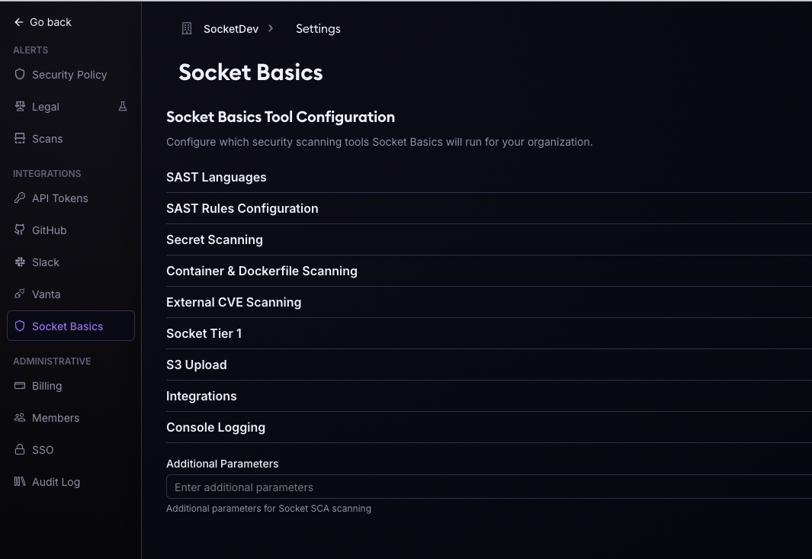
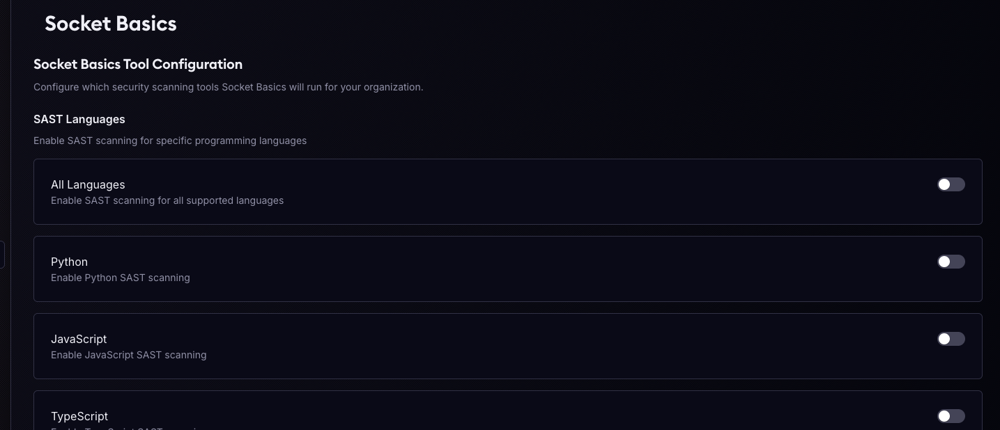
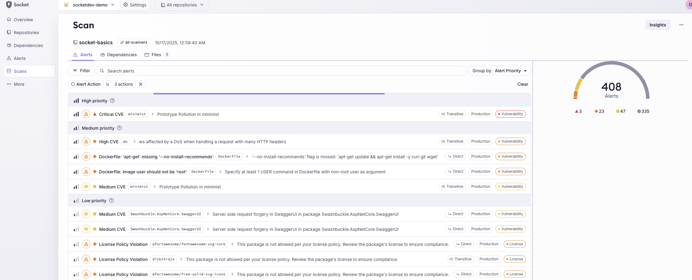

# GitHub Actions Integration

Complete guide to integrating Socket Basics into your GitHub Actions workflows for automated security scanning.

## Table of Contents

- [Quick Start](#quick-start)
- [Performance and Caching](#performance-and-caching)
- [Basic Configuration](#basic-configuration)
- [Enterprise Features](#enterprise-features)
- [Advanced Workflows](#advanced-workflows)
  - [Dockerfile Auto-Discovery](#dockerfile-auto-discovery)
- [Configuration Reference](#configuration-reference)
- [Troubleshooting](#troubleshooting)

## Quick Start

Add Socket Basics to your workflow in 3 steps:

1. **Create workflow file** at `.github/workflows/security-scan.yml`
2. **Add required secrets** to your repository
3. **Configure scanning options**

### Minimal Example

```yaml
name: Security Scan
on:
  pull_request:
    types: [opened, synchronize, reopened]

permissions:
  contents: read

jobs:
  security-scan:
    permissions:
      issues: write
      contents: read
      pull-requests: write
    runs-on: ubuntu-24.04
    timeout-minutes: 15
    steps:
      - uses: actions/checkout@de0fac2e4500dabe0009e67214ff5f5447ce83dd # v6.0.2
      - name: Run Socket Basics
        uses: SocketDev/socket-basics@v3.1.0
        env:
          GITHUB_PR_NUMBER: ${{ github.event.pull_request.number || github.event.issue.number }}
        with:
          github_token: ${{ secrets.GITHUB_TOKEN }}
          socket_security_api_key: ${{ secrets.SOCKET_SECURITY_API_KEY }}
```

With just your `SOCKET_SECURITY_API_KEY`, all scanning configurations are managed through the [Socket Dashboard](https://socket.dev/dashboard) — no workflow changes needed.

## Performance and Caching

### How the action is currently built

When you reference `uses: SocketDev/socket-basics@v3.1.0`, GitHub Actions pulls the
pre-built image referenced by [`action.yml`](../action.yml). The historical multi-stage
Docker build still matters for maintainers because it determines what lands in the
published image:

| Improvement | Benefit |
|-------------|---------|
| Multi-stage stages (`trivy`, `trufflehog`, etc.) | GitHub's runner cache can reuse unchanged tool layers across runs |
| `python:3.12-slim` base | ~850 MB smaller final image → faster layer pulls on cold runners |
| `--mount=type=cache` for apt / uv / npm | Faster repeated builds locally and on self-hosted runners with a persistent cache |

**On standard GitHub-hosted runners** (ephemeral, no persistent Docker cache between
jobs), users mainly benefit from pulling a ready-made image instead of rebuilding
Socket Basics from source in every workflow run.

### Pre-built image

Starting with v2, the action pulls a pre-built image from GHCR rather than
building from source on every run. Pinning to a specific version tag (e.g. `@v3.1.0`)
means the action starts in seconds — the image is built, integration-tested, and
published before the release tag is ever created.

### If you're running socket-basics outside of the GitHub Action

If you run socket-basics in other CI systems (Jenkins, GitLab, CircleCI, etc.) or
as a standalone `docker run`, pull the pre-built image directly:

```bash
docker pull ghcr.io/socketdev/socket-basics:3.1.0
```

See [Local Docker Installation](local-install-docker.md) for usage examples.

### Why we're opinionated about pinning

Socket Basics is a security tool. Its own supply-chain integrity matters — if
the action itself is compromised or ships a bad release, every repo running it
is immediately affected. We've seen this happen across the ecosystem:

- **Floating tags** (`@v2`, `:latest`) auto-update on every new release.
  A single bad push silently reaches all users with no review gate. (We do
  publish `:latest`/`:latest-heavy` Docker aliases as an onboarding
  convenience, but treat them as exactly that — production pipelines should
  pin an exact version or digest.)
- **Version tags** (`@v3.1.0`) are better, but tags are mutable by default.
  A tag can be deleted and recreated pointing at a different commit. There are
  documented cases of this happening — maliciously and accidentally.
- **Commit SHAs** are the only truly immutable reference. A SHA cannot be
  reassigned. Combined with Dependabot, you get automated upgrades with a
  human review gate at zero ongoing maintenance cost.

We don't publish a floating major tag (`v2`) for the action. Docker image
version tags are immutable registry-side (enforced by an immutable-tag rule),
with `latest`/`latest-heavy` as the only floating aliases — but SHA/digest
pinning is still the recommendation for defence in depth.

### Pinning strategies

Two supported approaches, both managed by Dependabot:

---

**Strategy 1 — Commit SHA pin + Dependabot** *(recommended)*

The only truly immutable reference. Dependabot keeps it current automatically.

```yaml
- name: Run Socket Basics
  # Dependabot keeps this SHA up to date — see .github/dependabot.yml setup below.
  uses: SocketDev/socket-basics@<sha>  # v3.1.0
  with:
    socket_security_api_key: ${{ secrets.SOCKET_SECURITY_API_KEY }}
```

Get the SHA for any release:
```bash
git ls-remote https://github.com/SocketDev/socket-basics refs/tags/v3.1.0
```

---

**Strategy 2 — Version tag pin + Dependabot**

Acceptable if you trust that tags are immutable (they are — socket-basics
enforces tag protection rules). SHA pinning is still preferable for defence
in depth.

```yaml
- uses: SocketDev/socket-basics@v3.1.0
  with:
    socket_security_api_key: ${{ secrets.SOCKET_SECURITY_API_KEY }}
```

---

**Dependabot setup (works for both strategies)**

Add or extend `.github/dependabot.yml` in your repo:

```yaml
version: 2
updates:
  - package-ecosystem: "github-actions"
    directory: "/"
    schedule:
      interval: "weekly"
```

Dependabot opens a PR for each new release, updating the SHA or version tag
and keeping the `# v3.1.0` comment in sync. You review, approve, and merge
on your own schedule — automated upgrades with a human gate.

---

**Comparison**

| Strategy | Immutable? | Auto-updates | Review gate |
|---|---|---|---|
| `@v2` floating tag | ❌ (not published) | — | — |
| `@v3.1.0` + Dependabot | ✅ (tag protection enforced) | Yes (weekly PR) | Yes |
| `@<sha>` + Dependabot | ✅ always | Yes (weekly PR) | Yes |

## Basic Configuration

### Required Permissions

Socket Basics requires the following permissions to post PR comments and create issues:

```yaml
permissions:
  issues: write        # Severity labels are managed through the issues API
  contents: read       # Read repository contents
  pull-requests: write # Post and update the findings comment
```

Include these in your workflow's `jobs.<job_id>.permissions` section.

### Required Inputs

**`github_token`** (required for PR comments and labels)
- GitHub token for posting PR comments and API access
- Use `${{ secrets.GITHUB_TOKEN }}` (automatically provided)
- Also set `GITHUB_PR_NUMBER` in the step `env:` as shown in the Quick Start. On
  `pull_request` events the number is also read from the event payload, so the
  env entry is a belt-and-braces default that keeps the same workflow working on
  `issue_comment` and other triggers.

**`socket_security_api_key`** (required to upload results and load dashboard configuration)
- Without it the scan still runs and comments on the PR, but nothing reaches the Socket dashboard.

**`socket_org`** (optional)
- Discovered from the API key when the key has the `socket-basics` scope. Set it
  explicitly when configuring the scan from `with:` inputs instead of the dashboard.
- Outside the action the same value is `SOCKET_ORG` or `--socket-org`. See the
  [name mapping](parameters.md#name-mapping) for the equivalents of every input.

### Common Scanning Options

**SAST (Static Analysis):**
```yaml
- uses: SocketDev/socket-basics@v3.1.0
  with:
    github_token: ${{ secrets.GITHUB_TOKEN }}
    # Enable SAST for specific languages
    python_sast_enabled: 'true'
    javascript_sast_enabled: 'true'
    go_sast_enabled: 'true'
    java_sast_enabled: 'true'
    # Or enable all languages
    all_languages_enabled: 'true'
```

**Secret Scanning:**
```yaml
- uses: SocketDev/socket-basics@v3.1.0
  with:
    github_token: ${{ secrets.GITHUB_TOKEN }}
    secret_scanning_enabled: 'true'
    # Optional: exclude directories
    trufflehog_exclude_dir: 'node_modules,vendor,dist'
    # Optional: show unverified secrets
    trufflehog_show_unverified: 'true'
```

**Container Scanning:**
```yaml
- uses: SocketDev/socket-basics@v3.1.0
  with:
    github_token: ${{ secrets.GITHUB_TOKEN }}
    # Listing images or Dockerfiles auto-enables the matching Trivy scan.
    # Images must be reachable from the job: public, pullable after an earlier
    # `docker login` step, or built earlier in the same job.
    container_images: 'nginx:1.27.4,ghcr.io/your-org/api:1.4.2'
    dockerfiles: 'Dockerfile,docker/Dockerfile.prod'
    # Optional: Trivy vulnerability scanning for supported language ecosystems
    trivy_vuln_enabled: 'true'
```

> [!NOTE]
> Trivy is bundled in the pre-built action image (a Socket-built distribution,
> rebuilt from unmodified upstream source and pinned by digest), so these inputs
> need no extra setup. Only a native install needs the version guidance in
> [Trivy (Container Scanning)](local-installation.md#trivy-container-scanning).

**Socket Tier 1 Reachability:**
```yaml
- uses: SocketDev/socket-basics@v3.1.0
  with:
    github_token: ${{ secrets.GITHUB_TOKEN }}
    socket_tier_1_enabled: 'true'
```

### Output Configuration

```yaml
- uses: SocketDev/socket-basics@v3.1.0
  with:
    github_token: ${{ secrets.GITHUB_TOKEN }}
    python_sast_enabled: 'true'
    # Enable tabular console output
    console_tabular_enabled: 'true'
    # Or enable JSON output
    console_json_enabled: 'true'
    # Enable verbose logging for debugging
    verbose: 'true'
```

## Diff-Only Mode (Changed Files)

By default the scanners run against the **entire repository**, so every PR
re-reports the whole repo's existing findings. To report only on what the PR
changed — the way Socket SCA Pull Request alerts behave — use the
`changed_files` input. This scopes SAST/OpenGrep, secret, and container scans to
the changed files and dramatically reduces PR finding volume.

```yaml
name: Socket Basics (PR diff-only)
on:
  pull_request:

jobs:
  socket-basics:
    permissions:
      contents: read
      pull-requests: write
    runs-on: ubuntu-latest
    steps:
      - uses: actions/checkout@de0fac2e4500dabe0009e67214ff5f5447ce83dd # v6.0.2
        with:
          # Required so the PR base branch is available for the diff
          fetch-depth: 0

      - name: Run Socket Basics (changed files only)
        uses: SocketDev/socket-basics@v3.1.0
        env:
          GITHUB_PR_NUMBER: ${{ github.event.pull_request.number }}
        with:
          github_token: ${{ secrets.GITHUB_TOKEN }}
          # Diff-only: scope all scanners to files changed in this PR
          changed_files: 'auto'
          python_sast_enabled: 'true'
          javascript_sast_enabled: 'true'
          secret_scanning_enabled: 'true'
```

`changed_files` accepts:

- `auto` — the PR base diff in CI; staged changes only in a local run with no PR context
- `pr` — the PR base diff, and nothing else
- `current-commit` — files in the `HEAD` commit
- a commit hash — files changed in that commit
- a comma-separated file list — e.g. `src/app.py,src/utils.js`

> [!IMPORTANT]
> For `auto`/`pr` modes, check out with `fetch-depth: 0` so the base branch is
> available to diff against. Deletions are excluded, so a delete-only PR scans
> nothing rather than falling back to the whole repo. To scan an explicit file
> list regardless of git state, use the `scan_files` input instead.

> [!NOTE]
> **When the diff cannot be resolved** — the checkout is unreadable, or the base
> branch is missing (most commonly a shallow clone without `fetch-depth: 0`) —
> Socket Basics **fails with a configuration error** naming the underlying git
> error. It does not scan.
>
> This is deliberate. Diff-only scoping is an explicit instruction, and if it
> cannot be honored there is no honest result to report:
>
> - **Skipping the scanners** would exit green having scanned zero files. A
>   passing check that inspected nothing is worse than a failing one, and a
>   warning buried in a run log is not something anyone acts on.
> - **Silently scanning everything** would do the expensive thing on every PR —
>   precisely what asking for a diff scope was avoiding. On a large repository
>   that is a slow or OOM-prone check, and it reports **pre-existing** findings
>   rather than the PR's own, so a checkout misconfiguration surfaces as large PR
>   comments on every PR until corrected.
>
> If the error appears on **every** PR, the cause is almost always a missing
> `fetch-depth: 0` — fix the checkout rather than sizing up the runner. Shallow
> checkouts get a more specific error naming that fix directly, including the
> `no merge base` shape where the base tip was fetched without connecting
> history.
>
> **To scan anyway, set `scan_all: true`.** That widens an unresolvable scope to
> a full-repository scan with a warning instead of failing. Every enabled scanner
> widens consistently on that failure path. `scan_all` does not override a scope
> that resolved successfully: the changed files remain authoritative, and a
> genuinely empty diff still skips the scoped scanners.
>
> A genuinely *empty* diff (e.g. a delete-only PR) is a successful resolution and
> still skips the scanners — only a **failed** resolution errors. The resolved
> file count is logged on every scoped run, so an empty diff and a failed lookup
> are always distinguishable in the logs.

### Checking that the scope took effect

Diff-only mode logs what it did. Look for these lines in the step output:

```text
INFO  Resolved PR diff base to 'origin/main'
INFO  Diff-only scan scoping requested (changed_files=auto): resolved 12 changed file(s)
INFO  Diff-only scan scoping active: 12 scan target(s) from 12 changed file(s)
```

If the scope could not be applied, the run fails and says why:

| Error or warning you will see | What to do |
|-------------------------------|------------|
| `this checkout is shallow ... Set 'fetch-depth: 0'` | Add `fetch-depth: 0` to `actions/checkout` |
| `no pull request base was found` | The trigger is not `pull_request`, so there is no base. Use `changed_files: 'current-commit'` or an explicit file list |
| `is not a git repository` | Run `actions/checkout` before the scan step |
| `git refused to read ... even with ... safe.directory` | The checkout is damaged or incomplete. Re-run `actions/checkout`, or pass an explicit file list |
| `the scope could not be resolved` | Fix the preceding Git error, or set `scan_all: true` to opt into a full-repository fallback |

A successful empty diff is logged separately as genuinely empty and skips the
scoped scanners; it is never conflated with a resolution failure.

You do not need `git config --global --add safe.directory` for this. The scan
runs as root inside a container over a workspace owned by the runner user, and
git normally refuses that with `detected dubious ownership`. Git subprocesses
mark the explicitly selected workspace as a command-scoped `safe.directory`, so
no config files are changed and no workflow change is needed. Setting
`safe.directory` in a workflow step would not have helped anyway, because it
writes the runner's git config rather than the container's.

### Where the setting can come from

`changed_files` is honored identically from the action input, the
`INPUT_CHANGED_FILES` environment variable, the `--changed-files` CLI flag, a
`--config` JSON file, and a Socket dashboard config. `scan_all` is only the
fail-open fallback when one of those requests cannot be resolved; it does not
override a successfully resolved scope.

## PR Comment Customization

Socket Basics automatically posts enhanced PR comments with **smart defaults that work out of the box** — clickable file links, collapsible sections, syntax highlighting, CVE links, CVSS scores, and auto-labels are all enabled by default.

To run the scan without commenting on the PR at all, set `pr_comment_enabled: 'false'`. The scan still runs, findings are still uploaded to the Socket dashboard, and the job still fails on high/critical findings — only the comment is suppressed. If you want a quieter comment rather than no comment, `pr_comment_collapse_all: 'true'` closes the SAST and Socket Tier 1 sections, critical findings included.

📖 **[PR Comment Guide →](github-pr-comment-guide.md)** — Complete customization options, configuration examples, and reference table

## Enterprise Features

Socket Basics Enterprise features require a [Socket Enterprise](https://socket.dev/enterprise) subscription.

### Dashboard Configuration

Configure Socket Basics centrally from the [Socket Dashboard](https://socket.dev/dashboard):



**Setup:**
1. Log in to [Socket Dashboard](https://socket.dev/dashboard)
2. Navigate to Settings → Socket Basics
3. Configure scanning policies, notification channels, and rule sets
4. Save your configuration

**Enable in workflow:**
```yaml
- uses: SocketDev/socket-basics@v3.1.0
  env:
    GITHUB_PR_NUMBER: ${{ github.event.pull_request.number || github.event.issue.number }}
  with:
    github_token: ${{ secrets.GITHUB_TOKEN }}
    # Dashboard configuration (Enterprise required)
    socket_org: 'your-org-slug'
    socket_security_api_key: ${{ secrets.SOCKET_SECURITY_API_KEY }}
```

> [!NOTE]
> You can also pass credentials using environment variables instead of the `with:` section:
> ```yaml
> - uses: SocketDev/socket-basics@v3.1.0
>   env:
>     SOCKET_SECURITY_API_KEY: ${{ secrets.SOCKET_SECURITY_API_KEY }}
>   with:
>     github_token: ${{ secrets.GITHUB_TOKEN }}
> ```
> Both approaches work identically. Use whichever fits your workflow style.

Your workflow will automatically use the settings configured in the dashboard.



### Notification Integrations

All notification integrations require Socket Enterprise.

**Slack Notifications:**
```yaml
- uses: SocketDev/socket-basics@v3.1.0
  with:
    github_token: ${{ secrets.GITHUB_TOKEN }}
    socket_org: ${{ secrets.SOCKET_ORG }}
    socket_security_api_key: ${{ secrets.SOCKET_SECURITY_API_KEY }}
    python_sast_enabled: 'true'
    # Slack webhook (Enterprise required)
    slack_webhook_url: ${{ secrets.SLACK_WEBHOOK_URL }}
```

**Jira Issue Creation:**
```yaml
- uses: SocketDev/socket-basics@v3.1.0
  with:
    github_token: ${{ secrets.GITHUB_TOKEN }}
    socket_org: ${{ secrets.SOCKET_ORG }}
    socket_security_api_key: ${{ secrets.SOCKET_SECURITY_API_KEY }}
    python_sast_enabled: 'true'
    # Jira integration (Enterprise required)
    jira_url: 'https://your-org.atlassian.net'
    jira_email: ${{ secrets.JIRA_EMAIL }}
    jira_api_token: ${{ secrets.JIRA_API_TOKEN }}
    jira_project: 'SEC'
```

**Microsoft Teams:**
```yaml
- uses: SocketDev/socket-basics@v3.1.0
  with:
    github_token: ${{ secrets.GITHUB_TOKEN }}
    socket_org: ${{ secrets.SOCKET_ORG }}
    socket_security_api_key: ${{ secrets.SOCKET_SECURITY_API_KEY }}
    python_sast_enabled: 'true'
    # MS Teams webhook (Enterprise required)
    msteams_webhook_url: ${{ secrets.MSTEAMS_WEBHOOK_URL }}
```

**Generic Webhook:**
```yaml
- uses: SocketDev/socket-basics@v3.1.0
  with:
    github_token: ${{ secrets.GITHUB_TOKEN }}
    socket_org: ${{ secrets.SOCKET_ORG }}
    socket_security_api_key: ${{ secrets.SOCKET_SECURITY_API_KEY }}
    python_sast_enabled: 'true'
    # Generic webhook (Enterprise required)
    webhook_url: ${{ secrets.WEBHOOK_URL }}
```

**SIEM Integration:**
```yaml
- uses: SocketDev/socket-basics@v3.1.0
  with:
    github_token: ${{ secrets.GITHUB_TOKEN }}
    socket_org: ${{ secrets.SOCKET_ORG }}
    socket_security_api_key: ${{ secrets.SOCKET_SECURITY_API_KEY }}
    python_sast_enabled: 'true'
    # Microsoft Sentinel (Enterprise required)
    ms_sentinel_workspace_id: ${{ secrets.MS_SENTINEL_WORKSPACE_ID }}
    ms_sentinel_shared_key: ${{ secrets.MS_SENTINEL_SHARED_KEY }}
    # Sumo Logic (Enterprise required)
    sumologic_endpoint: ${{ secrets.SUMOLOGIC_ENDPOINT }}
```

## Advanced Workflows

### Multi-Language Scan

```yaml
name: Comprehensive Security Scan
on:
  pull_request:
    types: [opened, synchronize, reopened]
  push:
    branches: [main, develop]

jobs:
  security-scan:
    permissions:
      issues: write
      contents: read
      pull-requests: write
    runs-on: ubuntu-latest
    steps:
      - uses: actions/checkout@de0fac2e4500dabe0009e67214ff5f5447ce83dd # v6.0.2
      
      - name: Run Socket Basics
        uses: SocketDev/socket-basics@v3.1.0
        env:
          GITHUB_PR_NUMBER: ${{ github.event.pull_request.number || github.event.issue.number }}
        with:
          github_token: ${{ secrets.GITHUB_TOKEN }}
          socket_org: ${{ secrets.SOCKET_ORG }}
          socket_security_api_key: ${{ secrets.SOCKET_SECURITY_API_KEY }}
          
          # Enable multiple languages (javascript_sast_enabled covers TypeScript)
          python_sast_enabled: 'true'
          javascript_sast_enabled: 'true'
          go_sast_enabled: 'true'
          
          # Security scans
          secret_scanning_enabled: 'true'
          socket_tier_1_enabled: 'true'
          
          # Notifications (Enterprise)
          slack_webhook_url: ${{ secrets.SLACK_WEBHOOK_URL }}
```

### Scheduled Scanning

```yaml
name: Weekly Security Audit
on:
  schedule:
    # Run every Monday at 9 AM UTC
    - cron: '0 9 * * 1'
  workflow_dispatch:  # Allow manual trigger

jobs:
  security-audit:
    permissions:
      issues: write
      contents: read
      pull-requests: write
    runs-on: ubuntu-latest
    steps:
      - uses: actions/checkout@de0fac2e4500dabe0009e67214ff5f5447ce83dd # v6.0.2
      
      - name: Run Full Security Scan
        uses: SocketDev/socket-basics@v3.1.0
        env:
          GITHUB_PR_NUMBER: ${{ github.event.pull_request.number || github.event.issue.number }}
        with:
          github_token: ${{ secrets.GITHUB_TOKEN }}
          socket_org: ${{ secrets.SOCKET_ORG }}
          socket_security_api_key: ${{ secrets.SOCKET_SECURITY_API_KEY }}
          
          # Scan all supported languages
          all_languages_enabled: 'true'
          
          # Enable all security features
          secret_scanning_enabled: 'true'
          socket_tier_1_enabled: 'true'
          
          # Verbose output for audit trail
          verbose: 'true'
          console_tabular_enabled: 'true'
          
          # Send to multiple channels (Enterprise)
          slack_webhook_url: ${{ secrets.SLACK_WEBHOOK_URL }}
          jira_url: ${{ secrets.JIRA_URL }}
          jira_email: ${{ secrets.JIRA_EMAIL }}
          jira_api_token: ${{ secrets.JIRA_API_TOKEN }}
          jira_project: 'SEC'
```

### Container Security Pipeline

> [!NOTE]
> The pre-built GitHub Action bundles Trivy (a Socket-built distribution,
> rebuilt from unmodified upstream source and pinned by digest), so the
> container-scanning inputs below work out of the box with no Trivy install step.

```yaml
name: Container Security
on:
  pull_request:
    types: [opened, synchronize, reopened]
  push:
    branches: [main]
    paths:
      - 'Dockerfile*'
      - 'docker/**'

jobs:
  container-scan:
    permissions:
      issues: write
      contents: read
      pull-requests: write
    runs-on: ubuntu-latest
    steps:
      - uses: actions/checkout@de0fac2e4500dabe0009e67214ff5f5447ce83dd # v6.0.2
      
      - name: Build Docker Image
        run: docker build -t myapp:${{ github.sha }} .

      - name: Run Socket Basics (image + Dockerfile scan)
        uses: SocketDev/socket-basics@v3.1.0
        env:
          GITHUB_PR_NUMBER: ${{ github.event.pull_request.number }}
        with:
          github_token: ${{ secrets.GITHUB_TOKEN }}
          socket_security_api_key: ${{ secrets.SOCKET_SECURITY_API_KEY }}
          # The image built above is visible to the action through the runner's
          # Docker daemon; registry images must be pullable from the job.
          container_images: 'myapp:${{ github.sha }}'
          dockerfiles: 'Dockerfile'
```

### Dockerfile Auto-Discovery

For repositories with multiple Dockerfiles across different directories, you can automatically discover them instead of manually listing each path.

```yaml
name: Security Scan with Dockerfile Auto-Discovery
on:
  pull_request:
    types: [opened, synchronize, reopened]
  push:
    branches: [main]

jobs:
  discover-dockerfiles:
    runs-on: ubuntu-latest
    outputs:
      dockerfiles: ${{ steps.discover.outputs.dockerfiles }}
    steps:
      - uses: actions/checkout@de0fac2e4500dabe0009e67214ff5f5447ce83dd # v6.0.2

      - name: Discover Dockerfiles
        id: discover
        run: |
          DOCKERFILES=$(find . -type d \( \
            -name node_modules -o -name vendor -o -name .git -o \
            -name test -o -name tests -o -name testing -o -name __tests__ -o \
            -name fixture -o -name fixtures -o -name testdata -o \
            -name example -o -name examples -o -name sample -o -name samples -o \
            -name dist -o -name build -o -name out -o -name target -o \
            -name venv -o -name .venv -o -name .cache \
            \) -prune -o \
            -type f \( -name 'Dockerfile' -o -name 'Dockerfile.*' -o -name '*.dockerfile' \) \
            -print | sed 's|^./||' | paste -sd ',' -)

          echo "Discovered Dockerfiles: $DOCKERFILES"
          echo "dockerfiles=$DOCKERFILES" >> $GITHUB_OUTPUT

  security-scan:
    needs: discover-dockerfiles
    if: needs.discover-dockerfiles.outputs.dockerfiles != ''
    permissions:
      issues: write
      contents: read
      pull-requests: write
    runs-on: ubuntu-latest
    steps:
      - uses: actions/checkout@de0fac2e4500dabe0009e67214ff5f5447ce83dd # v6.0.2

      - name: Run Socket Basics
        uses: SocketDev/socket-basics@v3.1.0
        env:
          GITHUB_PR_NUMBER: ${{ github.event.pull_request.number || github.event.issue.number }}
        with:
          github_token: ${{ secrets.GITHUB_TOKEN }}
          # Discovered Dockerfiles feed Trivy-backed misconfiguration scanning,
          # which is bundled in the pre-built action image.
          dockerfiles: ${{ needs.discover-dockerfiles.outputs.dockerfiles }}
          verbose: 'true'
```

**How it works:**

1. **Discovery job** uses `find` to locate Dockerfiles matching common patterns:
   - `Dockerfile` (exact match)
   - `Dockerfile.*` (e.g., `Dockerfile.prod`, `Dockerfile.dev`)
   - `*.dockerfile` (e.g., `backend.dockerfile`)

2. **Excluded directories** prevent scanning test fixtures and build artifacts:
   - Package managers: `node_modules`, `vendor`, `venv`
   - Test directories: `test`, `tests`, `__tests__`, `fixtures`
   - Build outputs: `dist`, `build`, `out`, `target`

3. **Scan job** receives discovered paths via job output and skips if none found

**Customizing discovery patterns** (edit the `find` expression in the discovery step):

```bash
# Only scan production Dockerfiles
-type f -name 'Dockerfile.prod' -print

# Add custom exclusions
-name custom_test_dir -o -name legacy -o \
```

### Custom Rule Configuration

Use custom rules from your repository by setting `use_custom_sast_rules` and
`custom_sast_rule_path`. This path is resolved relative to `GITHUB_WORKSPACE`
in GitHub Actions.

```yaml
name: Security Scan with Custom SAST Rules
on:
  pull_request:
    types: [opened, synchronize, reopened]

jobs:
  security-scan:
    permissions:
      issues: write
      contents: read
      pull-requests: write
    runs-on: ubuntu-latest
    steps:
      - uses: actions/checkout@de0fac2e4500dabe0009e67214ff5f5447ce83dd # v6.0.2
      
      - name: Run Socket Basics
        uses: SocketDev/socket-basics@v3.1.0
        env:
          GITHUB_PR_NUMBER: ${{ github.event.pull_request.number || github.event.issue.number }}
        with:
          github_token: ${{ secrets.GITHUB_TOKEN }}

          # Enable SAST languages you expect to run.
          python_sast_enabled: 'true'
          javascript_sast_enabled: 'true'

          # Enable custom rules from repository path.
          use_custom_sast_rules: 'true'
          custom_sast_rule_path: '.socket/rules'

          # Optional: to avoid allowlist exclusions, run all rules for enabled languages.
          all_rules_enabled: 'true'

          # Optional: enable specific bundled or custom rule IDs.
          javascript_enabled_rules: 'eval-usage,prototype-pollution'

          # Ignore one or more SAST rules globally or for exact repo-relative files
          sast_ignore_overrides: 'js-sql-injection:index.js'
```

Important behavior:
- `socket_security_api_key` + `socket_org` enables dashboard config loading.
- Dashboard/API settings override overlapping `with:` values.
- `<language>_enabled_rules` is an allowlist and can suppress custom rule IDs.
- `all_rules_enabled: 'true'` disables allowlist filtering for enabled languages.

`sast_ignore_overrides` supports:
- `rule_id` to ignore a SAST rule everywhere in the repo
- `rule_id:path` to ignore a SAST rule for one exact repo-relative file

Examples:
- `js-sql-injection`
- `js-sql-injection:index.js`
- `js-sql-injection:src/unsafe/demo.js`
- `js-express-async-no-error-handler,js-sql-injection:index.js,js-missing-helmet`

Notes:
- Paths must be exact repo-relative paths using `/` separators after normalization.
- Windows-style input such as `src\\unsafe\\demo.js` is accepted and normalized automatically.
- Globs and directory-prefix matching are not supported in this first version.
- A `rule_id:path` entry is an exact `rule_id AND path` match. If the path does not match, Socket Basics will not fall back to a rule-only ignore.
- Broad dashboard rule disables such as `<language>_disabled_rules` still ignore that rule everywhere in the repo. If both are configured, the broad disabled-rule behavior can make it look like a narrow path override matched when it did not.
- In `.socket.facts.json`, ignored alerts include `actionReason` so you can see whether the ignore came from `sast_ignore_override` or `disabled_rule`.

## Configuration Reference

### All Available Inputs

See [`action.yml`](../action.yml) for the complete list of inputs.

Every input has a CLI flag and environment-variable equivalent; the
[name mapping](parameters.md#name-mapping) lists them side by side.

**Core Configuration:**
- `socket_org` — Socket organization slug (Enterprise)
- `socket_security_api_key` — Socket Security API key (Enterprise)
- `github_token` — GitHub token (required for PR comments and labels)
- `verbose` — Enable verbose logging in the step log
- `console_tabular_enabled` — Tabular console output in the step log
- `console_json_enabled` — JSON console output in the step log
- The action always scans `GITHUB_WORKSPACE` (there is no `workspace` input);
  narrow the scope with the inputs below.

**Scan Scope:**
- `changed_files` — Diff-only mode (`auto`, `pr`, `current-commit`, a commit hash, or a file list)
- `scan_files` — Explicit comma-separated file list
- `scan_all` — Fail-open fallback when a `changed_files` scope cannot be resolved

**SAST Languages:**
- `all_languages_enabled` — Enable all languages
- `python_sast_enabled`, `javascript_sast_enabled` (covers TypeScript)
- `go_sast_enabled`, `golang_sast_enabled`
- `java_sast_enabled`, `php_sast_enabled`, `ruby_sast_enabled`
- `csharp_sast_enabled`, `dotnet_sast_enabled`
- `c_sast_enabled`, `cpp_sast_enabled`
- `kotlin_sast_enabled`, `scala_sast_enabled`, `swift_sast_enabled`
- `rust_sast_enabled`, `elixir_sast_enabled`, `erlang_sast_enabled`
- `all_rules_enabled` — Run every bundled rule for the enabled languages (disables the per-language allowlists)
- `opengrep_notification_method` — Route SAST findings to one notifier (e.g. `console`, `slack`)

**Rule Configuration (per language):**
- `<language>_enabled_rules` — Comma-separated rules to enable
- `<language>_disabled_rules` — Comma-separated rules to disable
- `use_custom_sast_rules` — Enable custom SAST rule discovery from repo files
- `custom_sast_rule_path` — Relative path to custom SAST rule directory
- `sast_ignore_overrides` — Comma-separated `rule_id` or `rule_id:path` SAST ignore overrides

**Security Scanning:**
- `secret_scanning_enabled` — Enable secret scanning
- `disable_all_secrets` — Turn every secret-scanning feature off
- `trufflehog_exclude_dir` — Directories to exclude
- `trufflehog_show_unverified` — Show unverified secrets
- `trufflehog_notification_method` — Route secret findings to one notifier (`notification_method` is a deprecated alias)
- `socket_tier_1_enabled` — Socket Tier 1 reachability
- `socket_additional_params` — Extra arguments for `socket scan reach`

**Container Scanning:**
- `container_images` — Comma-separated images to scan (auto-enables image scanning)
- `dockerfiles` — Comma-separated Dockerfiles to scan (auto-enables Dockerfile scanning)
- `trivy_disabled_rules` — Trivy rules to disable
- `trivy_image_scanning_disabled` — Disable image scanning
- `trivy_vuln_enabled` — Enable vulnerability scanning for supported language ecosystems
- `trivy_notification_method` — Route container findings to one notifier

> [!NOTE]
> Container scanning is backed by Trivy, bundled in the pre-built GitHub
> Action image (a Socket-built distribution, pinned by digest) — these inputs
> work without any extra setup.

**Notifications (Enterprise Required):**
- `slack_webhook_url` — Slack webhook
- `jira_url`, `jira_email`, `jira_api_token`, `jira_project` — Jira config (`server` and `project` are deprecated aliases)
- `msteams_webhook_url` — MS Teams webhook
- `webhook_url` — Generic webhook
- `ms_sentinel_workspace_id`, `ms_sentinel_shared_key` (alias `ms_sentinel_key`) — MS Sentinel
- `sumologic_endpoint` — Sumo Logic

**PR Comments and Labels:**
- `pr_comment_enabled`, `pr_comment_collapse_all`, `pr_labels_enabled`, `pr_label_<severity>` and the
  other `pr_comment_*` inputs — see the [PR Comment Guide](github-pr-comment-guide.md)

**Storage (environment variables, not inputs):**
S3 upload is configured through the step `env:` block, not `with:`:
`SOCKET_S3_ENABLED`, `SOCKET_S3_BUCKET`, `SOCKET_S3_ACCESS_KEY`, `SOCKET_S3_SECRET_KEY`,
and optionally `SOCKET_S3_REGION` and `SOCKET_S3_ENDPOINT`. See
[S3 Upload Configuration](parameters.md#s3-upload-configuration).

### Environment Variables

Every `with:` input is delivered to the container as an `INPUT_<NAME>`
environment variable (the input name upper-cased), so the two forms below are
equivalent and either can be used in the step `env:` block:

```yaml
env:
  INPUT_PYTHON_SAST_ENABLED: 'true'
  INPUT_SECRET_SCANNING_ENABLED: 'true'
  SOCKET_ORG: ${{ secrets.SOCKET_ORG }}
  SOCKET_SECURITY_API_KEY: ${{ secrets.SOCKET_SECURITY_API_KEY }}
```

Plain (un-prefixed) names are accepted only for credentials, notifier endpoints
and a few GitHub context values (`SOCKET_ORG`, `SOCKET_SECURITY_API_KEY`,
`GITHUB_TOKEN`, `SLACK_WEBHOOK_URL`, `JIRA_URL`, ...). A scanner toggle such as
`PYTHON_SAST_ENABLED` without the `INPUT_` prefix is ignored. The full list is
in the [name mapping](parameters.md#name-mapping).

## Troubleshooting

### Action Not Finding Files

**Problem:** Scanner reports no files found.

**Solution:** Ensure `actions/checkout` runs before Socket Basics:
```yaml
steps:
  - uses: actions/checkout@de0fac2e4500dabe0009e67214ff5f5447ce83dd # v6.0.2 - Must be first
  - uses: SocketDev/socket-basics@v3.1.0
```

### PR Comments Not Appearing

**Problem:** Security findings don't appear as PR comments.

**Solutions:**
1. Verify `github_token` is provided
2. Check workflow permissions:
```yaml
permissions:
  contents: read
  pull-requests: write
  issues: write   # only needed for severity labels
```
3. Make sure the run knows which PR it is on. Pass the number explicitly, as the
   Quick Start does, so it works on every trigger:
```yaml
env:
  GITHUB_PR_NUMBER: ${{ github.event.pull_request.number || github.event.issue.number }}
```
4. Check that `pr_comment_enabled` has not been set to `'false'` (in the
   workflow or in the Socket dashboard configuration). The scan then runs and
   uploads results but deliberately posts nothing.
5. Nothing is posted when there are no findings above the reporting threshold.
   Look for `GithubPRNotifier` lines in the step log to see what the notifier
   decided and why.

### Results Not Showing in the Socket Dashboard

**Problem:** The action is green but no full scan appears in the dashboard.

**Solutions:**
1. Provide `socket_security_api_key`. Without it the scan runs locally only.
2. Check the log for `No Socket organization configured`. Either set `socket_org`
   or use an API key with the `socket-basics` scope so the organization can be
   discovered from the key.
3. Check the token scopes: `full-scans` is required to upload;
   `socket-basics` is required to load dashboard configuration. `Insufficient
   permissions` in the log means a scope is missing.
4. `pr_comment_enabled: 'false'` does **not** affect the upload; results still
   reach the dashboard.

### Container Scanning Fails

**Problem:** Container image scanning fails.

**Solutions:**

1. For private images, add authentication:
```yaml
- name: Login to Registry
  run: echo "${{ secrets.DOCKER_PASSWORD }}" | docker login -u "${{ secrets.DOCKER_USERNAME }}" --password-stdin
```

### Enterprise Features Not Working

**Problem:** Dashboard configuration or notifications not working.

**Solutions:**
1. Verify Socket Enterprise subscription is active
2. Check that `socket_org` and `socket_security_api_key` are set correctly
3. Confirm API key has required permissions in Socket Dashboard

### `sast_ignore_overrides` Seems Too Broad

**Problem:** A `rule_id:path` override appears to ignore findings outside the specified file.

**Likely cause:** The rule is also disabled more broadly in dashboard settings or other config through `<language>_disabled_rules`.

**How to confirm:**
1. Open the generated `.socket.facts.json`
2. Find the ignored alert and inspect `actionReason`
3. `actionReason: "sast_ignore_override"` means the exact path override matched
4. `actionReason: "disabled_rule"` means the finding was ignored by a broad rule disable instead

**Additional signal:** If the configured path does not exist under the workspace, Socket Basics logs a warning and does not fall back to rule-only matching.

### Large Repositories and Monorepos

**Problem:** The action is slow, runs out of memory, posts very large PR
comments, or produces a huge `.socket.facts.json`.

`all_languages_enabled` over a whole monorepo runs every SAST rule set against
every file on every PR. Independently of findings, the SAST connector also
records **one component per non-gitignored file in the workspace**, so the
facts file grows with the file count, and repositories that commit media,
vendored code or generated assets produce very large uploads.

**Solutions:**
1. Scope PR runs to the diff. `changed_files: 'auto'` (with `fetch-depth: 0`)
   makes each PR report only its own changes and is the single biggest win.
2. Enable only the languages the repository actually uses instead of
   `all_languages_enabled`.
3. Keep generated and vendored trees out of git or list them in `.gitignore`;
   ignored files are excluded from the inventory. `trufflehog_exclude_dir`
   affects secret scanning only.
4. For multi-project monorepos, run one job per project with `scan_files` /
   `changed_files`, or use the Docker image with a per-project `--workspace` (see
   [Local Docker Installation](local-install-docker.md#large-repositories-and-monorepos)).
5. Use a self-hosted runner with more memory only after the above.

### Rate Limiting

**Problem:** GitHub API rate limit exceeded.

**Solution:** Use a personal access token with higher limits:
```yaml
with:
  github_token: ${{ secrets.GITHUB_PAT }}
```

## Example Results



---

**Next Steps:**
- [Pre-Commit Hook Setup](pre-commit-hook.md) — Catch issues before commit
- [Local Installation](local-installation.md) — Run scans from your terminal
- [Parameters Reference](parameters.md) — Every CLI flag, action input and environment variable, with the mapping between them
